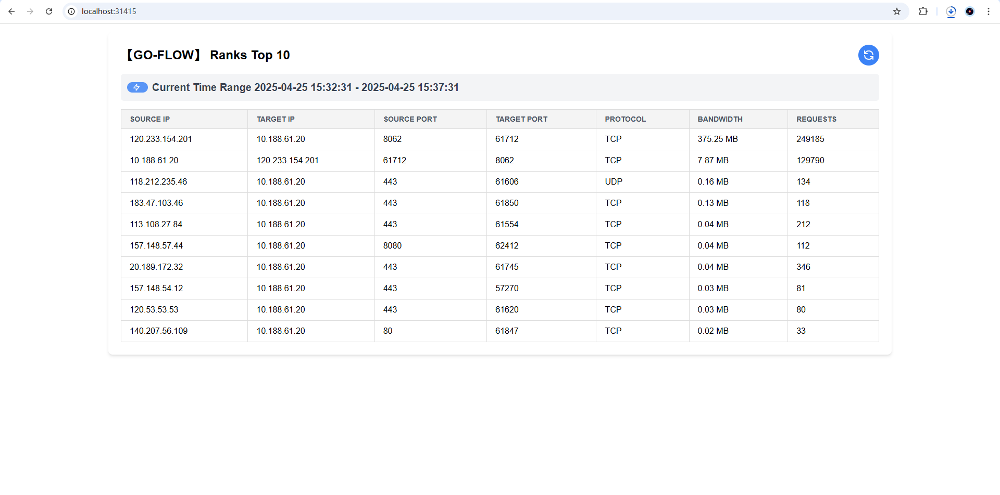

# go-flow

## Overview

go-flow is a lightweight, high-performance tool for real-time network traffic monitoring and DDoS detection. It captures TCP/UDP packets and analyzes within a configurable sliding time window.

## Usage

```
# For centos

# Ensure libpcap installed
# sudo yum install libpcap -y
chmod +x go-flow
./go-flow --eth=<network interface>

# For windows
./go-flow.exe --eth=<network interface>
```

## Options
```
--size int
        Size of the sliding window in minutes (default 5)
--workers int
        Number of worker threads to process packets (default 1000)
--rank int
        Number of top IPs to display (default 10)
```

## Screenshot
```
http://ip_address:31415
```


## Build

```
git clone https://github.com/xxddpac/go-flow.git
cd go-flow

# Build for CentOS
make build-centos
# Output: bin/go-flow

# Build for Windows
make build-win
# Output: bin/go-flow.exe

# Clean build artifacts
make clean
```