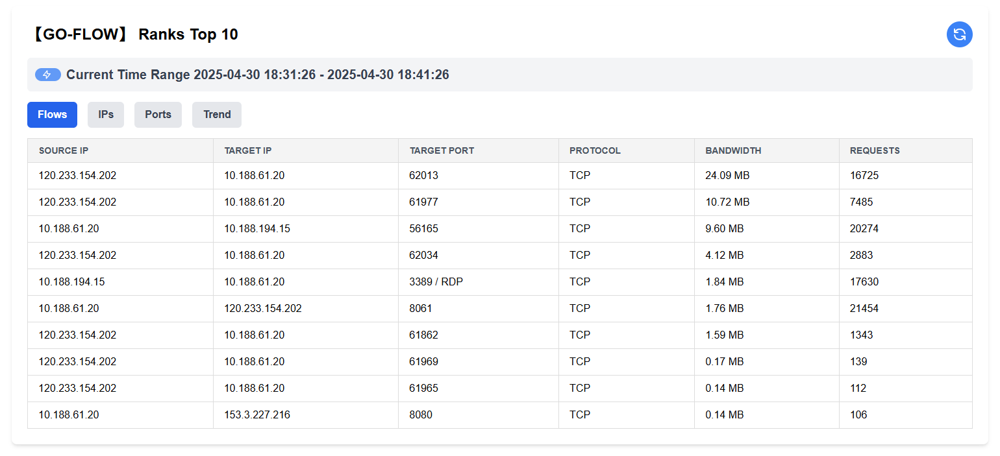
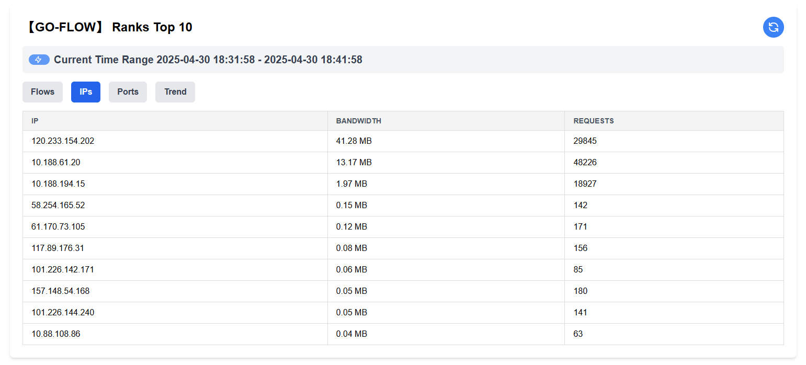
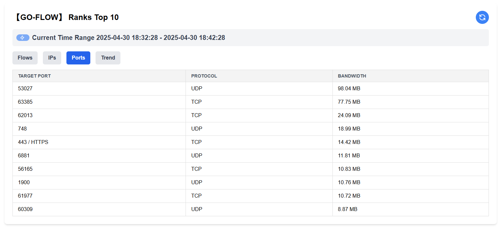

# go-flow

[中文文档（Chinese Docs）](https://github.com/xxddpac/go-flow/blob/main/README_ZH.md)

## Overview

go-flow is a lightweight and efficient real-time network traffic monitoring tool, ideal for medium-scale traffic
environments. It captures TCP/UDP packets and analyzes traffic using a configurable sliding time window. Designed for
simplicity and performance, it also includes a built-in web UI for intuitive, real-time visualization.

## Usage

```
# Download the binary from new latest release

# For Linux
chmod +x go-flow
./go-flow --eth=<network interface>

# For windows
./go-flow.exe --eth=<network interface>
```

## Options

```
--size int
        Size of the sliding window in minutes (default 5)
--workers int
        Number of worker threads to process packets (default 1000)
--rank int
        Number of top IPs to display (default 10)
```

## Web UI

```
http://ip_address:31415
```

## Screenshot
- `Flows` show the top N flows detail in sliding window



- `IPs` show the top N IPs use total bandwidth in sliding window



- `Ports` show the top N Ports use total bandwidth in sliding window



- `Trend` show the Trend of the bandwidth in sliding window


## Build

```
git clone https://github.com/xxddpac/go-flow.git
cd go-flow

# Build for CentOS
make build-centos
# Output: bin/go-flow

# Build for Windows
make build-win
# Output: bin/go-flow.exe

# Clean build artifacts
make clean
```